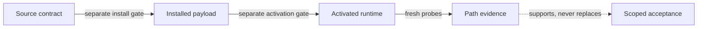

<!-- doc_id: signalbox.readme; language: en; contract_revision: 3 -->
<!-- contracts: SIG-01 SIG-02 IDENT-01 CLAIM-01 DOC-02 ACCEPT-08 -->

**English** · [简体中文](README.zh-CN.md)

<a id="project-identity"></a>
# Signalbox

**A human-and-agent reference for understandable router-level traffic policy.**

Signalbox turns lessons from real router operations into reader guides,
portable contracts, public-safe examples, and verification. You do not need to
read every contract to use the guide: begin with one path below and descend
into the normative core only when you are implementing or reviewing policy.
`SIG-01`

<a id="choose-your-path"></a>
## Choose your path

- **I want the practical router mental model.** Read the [basic router
  guide](docs/human/20-basic-router-guide.en.md): what moves to the router, what
  remains explicit, and what “fail closed” means in daily use.
- **I am designing routing or DNS policy.** Read [routing, DNS, and
  fail-closed](docs/human/30-routing-dns-and-fail-closed.en.md): ownership,
  precedence, protected lanes, health, and recovery boundaries.
- **I need private access through VPS gateways and a Tailnet.** Read the
  [canonical private-ingress guide](docs/human/40-tailnet-vps-private-ingress.en.md):
  one HTTPS origin, dedicated identities, exact destinations, and evidence.

New to the terms? The five-minute [Start here](docs/human/00-start-here.en.md)
and [architecture map](docs/human/10-architecture.en.md) remain the shortest
orientation.

<a id="what-signalbox-is"></a>
## What Signalbox is — and is not

Signalbox explains why a packet takes a path and gives an agent enough machine
contract to change that policy without confusing intended source with installed
or live truth. Its normative core covers transparent egress, DIRECT allowlists,
protected no-fallback lanes, fail-closed enforcement, private ingress, health,
and recovery.

It is not a proxy client, one-click installer, production-config mirror, or
health dashboard. It never treats passing source tests as evidence that a
router, exit, private origin, browser, or device is currently healthy. It
distils portable mechanisms without becoming a second production authority.
`SIG-02`

<a id="mintie-reference"></a>
## Mintie, the reference deployment

`Mintie` is the named sample, not required hardware and not another name for
Signalbox. The current reference platform is a [GL.iNet Beryl 7
(GL-MT3600BE)](https://www.gl-inet.com/products/gl-mt3600be/); Signalbox's roles
and contracts are intentionally portable to other capable routers. `IDENT-01`

| Kind | Signalbox example | Meaning |
| --- | --- | --- |
| Portable role | `general-primary` | Stable capability and policy semantics |
| Sample identity | `Alder` | Friendly identity in the Mintie reference deployment |
| Private live binding | outside this repository | Replaceable endpoint, provider, credential, address, and runtime state |

See the [Mintie reference files](examples/mintie/README.md) for the full
identity map and public-safe sample contracts.

<a id="source-of-truth"></a>
## Source of truth and proof boundaries

The repository deliberately keeps human explanation, machine contract, sample
deployment, and live implementation separate:

- [`docs/specification.md`](docs/specification.md) owns product meaning.
- [`contracts/`](contracts/) and [`schemas/`](schemas/) own machine semantics
  and structural validation.
- [`examples/mintie/`](examples/mintie/) is a public-safe reference projection.
- Private bindings, installed payloads, active runtime, and incident readback
  remain outside this repository.



One green layer proves only that layer; acceptance is orthogonal to technical
realization. `CLAIM-01`

<a id="verification"></a>
## Verify the source

Create an isolated development environment once, then run the complete gate:

```bash
python3 -m venv .venv
.venv/bin/python -m pip install --requirement requirements-dev.txt
make verify PYTHON=.venv/bin/python
```

The gate validates Draft 2020-12 JSON Schemas, cross-file policy semantics,
health/report/aggregate behavior, bilingual document pairs, public-safe sample
boundaries, links, and regression fixtures. Hosted CI repeats it on Python
3.11, 3.12, and 3.13. It proves the tracked source contract only.

For agents, continue with the [Agent Surface](docs/agent/README.md). For incident
mechanisms, see the [failure catalog](docs/reference/failure-catalog.md). For
the exact published boundary, see [current state](docs/current-state.md).

<a id="status-and-permission"></a>
## Status and permission

Foundation 0.2.1 and the F1 Human Surface are source-verified and published at
the exact commit and hosted gate recorded in [current
state](docs/current-state.md). Full Signalbox v1 remains incomplete; no
installed payload, live-router integration, private-ingress deployment, path
evidence, or owner acceptance is implied. `ACCEPT-08`

No license has been selected. Possession of or visibility into this repository
does not grant reuse rights. External code and documentation contributions are
not currently accepted until explicit contribution and rights terms exist.
