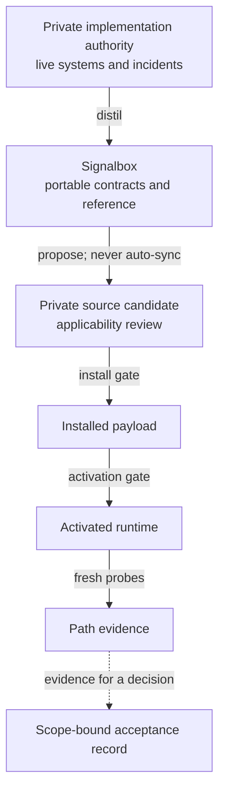

# Signalbox

**A human-and-agent reference for router-level traffic policy, transparent
egress, fail-closed enforcement, private ingress, health, and recovery.**

Signalbox turns lessons from real router operations into portable contracts,
explanations, examples, and verification. It helps a person understand why a
packet takes a path and helps an agent change that policy without confusing
source intent with installed or live truth.

Signalbox is not a proxy client, one-click installer, production configuration
mirror, or health dashboard. It never treats passing source tests as evidence
that a router, exit, private origin, browser, or device is currently healthy.

## The central separation

| Kind | Signalbox example | Meaning |
| --- | --- | --- |
| Portable role | `general-primary` | Stable capability and policy semantics |
| Sample identity | `Alder` | Friendly identity in the Mintie reference deployment |
| Private live binding | outside this repository | Replaceable endpoint, provider, credential, address, and runtime state |

`Mintie` is the reference router deployment. `Alder` and `Rowan` are sample
general egress identities; `Hearth` is the sample protected residential
egress. They make the reference concrete without freezing one private network
into the project contract.



The feedback loop is deliberate: real implementation can teach Signalbox, and
Signalbox can propose safer portable contracts back to an implementation.
Neither direction is automatic, and every live boundary keeps its own gate.
Acceptance is deliberately orthogonal to the technical realization chain: it
can record a person's scoped decision, but it cannot manufacture current path
evidence.

## Read it

- Start in Chinese: [从这里开始](docs/human/00-start-here.zh-CN.md)
- Start in English: [Start here](docs/human/00-start-here.en.md)
- Canonical product and architecture contract: [Specification](docs/specification.md)
- Machine contract registry and schemas: [Schema catalog](contracts/catalog.json)
  and [schema guide](schemas/README.md)
- For agents: [Agent reference](docs/agent/README.md)
- Reference deployment: [Mintie](examples/mintie/README.md)
- Incident-derived mechanisms: [Failure catalog](docs/reference/failure-catalog.md)
- Current repository truth: [Current state](docs/current-state.md)
- Private security reports: [Security policy](SECURITY.md)
- External contribution boundary: [Contributing](CONTRIBUTING.md)

## Validate it

Create an isolated development environment once, then run the complete gate:

```bash
python3 -m venv .venv
.venv/bin/python -m pip install --requirement requirements-dev.txt
make verify PYTHON=.venv/bin/python
```

The gate validates Draft 2020-12 JSON Schemas and the catalog first, then checks
cross-file role references, route precedence, per-subject health reports,
observation diversity, generation/freshness/gate semantics, member-preserving
aggregation, bilingual document pairs, public-safe sample boundaries, and
regression fixtures. Hosted CI repeats it on Python 3.11, 3.12, and 3.13. It
proves the tracked source contract only.

## Status and permission

Foundation 0.2 is source-verified, published, and protected by its hosted gate;
full Signalbox v1 is not complete. No installed payload, live router
integration, path evidence, or acceptance is implied; see [current
state](docs/current-state.md) for the exact published source commit, hosted run,
and repository policy.

No license has been selected. Possession of or visibility into this repository
does not grant reuse rights. External code and documentation contributions are
not currently accepted until explicit contribution and rights terms exist.
