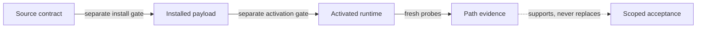

<!-- doc_id: signalbox.readme; language: en; contract_revision: 6 -->
<!-- contracts: SIG-01 SIG-02 IDENT-01 CLAIM-01 DOC-02 AUTH-05 ACCEPT-08 -->

**English** · [简体中文](README.zh-CN.md)

<a id="project-identity"></a>
# Signalbox

**A human-and-agent reference for understandable router-level traffic policy.**

Signalbox turns lessons from real router operations into reader guides,
portable contracts, public-safe examples, and verification. You do not need to
read every contract to use the guide: begin with one path below and descend
into the normative core only when you are implementing or reviewing policy.
`SIG-01`

<a id="choose-your-path"></a>
## Choose your path

- **I want the practical router mental model.** Read the [basic router
  guide](docs/human/20-basic-router-guide.en.md): what moves to the router, what
  remains explicit, and what “fail closed” means in daily use.
- **I am designing routing or DNS policy.** Read [routing, DNS, and
  fail-closed](docs/human/30-routing-dns-and-fail-closed.en.md): ownership,
  precedence, protected lanes, health, and recovery boundaries.
- **I want private services without starting another phone VPN.** Read the
  [Tailnet-on-VPS guide](docs/human/40-tailnet-vps-private-ingress.en.md):
  Mintie handles the covered application traffic, a dedicated VPS gateway joins
  the Tailnet, and the browser keeps its HTTPS address. Phone VPN encapsulation
  and cellular client access need their own compatibility and evidence.

New to the terms? The five-minute [Start here](docs/human/00-start-here.en.md)
and [architecture map](docs/human/10-architecture.en.md) remain the shortest
orientation.

Try one complete judgment in the [five worked cases](docs/human/50-worked-cases.en.md):
private/DIRECT overlap, domain versus IP-only routing, router-local versus LAN
coverage, awake versus sleeping clients, and newly published stale evidence.
An agent can follow the [executable workflow](docs/agent/workflow.md) from a
structured policy explanation to a validated claim/acceptance handoff.

### Browse the reading station

Signalbox's **telegraph reading station** brings these guides together with
the supplied cat illustrations, punched-tape mark, diagrams, cases and a
selectable workbench of synthetic replay receipts. Full article text is built
from the same repository Markdown; it is maintained in one place.

After installing the development requirements below:

```bash
make site PYTHON=.venv/bin/python
make site-serve PYTHON=.venv/bin/python
```

Open the loopback address printed by the preview command. See the
[station guide](site/README.md) for routes, build ownership, asset provenance,
font/diagram network requests and preview details. This is a source-built
reading surface; no hosted site or deployment is claimed.

<a id="what-signalbox-is"></a>
## What Signalbox is — and is not

Signalbox explains why a packet takes a path and gives an agent enough machine
contract to change that policy without confusing intended source with installed
or live truth. Its normative core covers transparent egress, DIRECT allowlists,
protected no-fallback lanes, fail-closed enforcement, private ingress, underlay
observability, health, and recovery.

It is not a proxy client, one-click installer, production-config mirror, or
health dashboard. It never treats passing source tests as evidence that a
router, exit, private origin, browser, or device is currently healthy. It
distils portable mechanisms without becoming a second production authority.
`SIG-02`

<a id="mintie-reference"></a>
## Mintie, the reference deployment

`Mintie` is the named sample, not required hardware and not another name for
Signalbox. The current reference platform is a [GL.iNet Beryl 7
(GL-MT3600BE)](https://www.gl-inet.com/products/gl-mt3600be/); Signalbox's roles
and contracts are intentionally portable to other capable routers. `IDENT-01`

| Kind | Signalbox example | Meaning |
| --- | --- | --- |
| Portable role | `general-primary` | Stable capability and policy semantics |
| Sample identity | `Alder` | Friendly identity in the Mintie reference deployment |
| Private live binding | outside this repository | Replaceable endpoint, provider, credential, address, and runtime state |

See the [Mintie reference files](examples/mintie/README.md) for the full
identity map and public-safe sample contracts.

<a id="source-of-truth"></a>
## Source of truth and proof boundaries

The repository deliberately keeps human explanation, machine contract, sample
deployment, and live implementation separate:

- [`docs/specification.md`](docs/specification.md) owns product meaning.
- [`contracts/`](contracts/) and [`schemas/`](schemas/) own machine semantics
  and structural validation.
- [`examples/mintie/`](examples/mintie/) is a public-safe reference projection.
- Private bindings, installed payloads, active runtime, and incident readback
  remain outside this repository.


```mermaid
flowchart LR
  SOURCE[Source contract] -->|separate install gate| INSTALLED[Installed payload]
  INSTALLED -->|separate activation gate| ACTIVE[Activated runtime]
  ACTIVE -->|fresh probes| PATH[Path evidence]
  PATH -.->|supports, never replaces| ACCEPT[Scoped acceptance]
```

One green layer proves only that layer; acceptance is orthogonal to technical
realization. `CLAIM-01`

<a id="verification"></a>
## Verify the source

Create an isolated development environment once, then run the complete gate:

```bash
python3 -m venv .venv
.venv/bin/python -m pip install --requirement requirements-dev.txt
make verify PYTHON=.venv/bin/python
```

The gate bootstraps the contract catalog from a fixed Draft 2020-12 schema,
validates cross-file policy and health semantics, checks bilingual document
pairs and contained links, and scans the current worktree bytes for every
textual path listed in the Git index against a bounded set of public-boundary
violations. Binary blobs are skipped without being followed or decoded;
symlink targets are inspected without being followed. This detector is not a
Git-history audit or a universal secret scanner. Hosted CI repeats the source
gate on Python 3.11, 3.12, and 3.13.
`AUTH-05`

### Try a source judgment

Run these from the repository root after setting up the environment above.
Each command reads public synthetic examples locally; none contacts a router
or applies a policy.

| What you want to inspect | Command | What the output establishes |
| --- | --- | --- |
| Why canonical private ingress has a complete reference chain | `.venv/bin/python -m scripts.policy` | `valid`, an origin → gateway → host → role/capabilities → subject/profile `chain`, and `diagnostics` for the Mintie source example |
| Whether a routing, coverage, freshness or sequence judgment matches its expected result | `.venv/bin/python -m scripts.replay` | Eight synthetic results; each `passed` compares `actual` with `expected` |
| Whether a scoped source claim and historical acceptance have valid references | `.venv/bin/python -m scripts.handoff --evaluated-at 2026-10-03T00:00:03Z` | `valid`, supported `claim_outcomes`, and `diagnostics` for the sample handoff |

For example, replay a report that has just been published but contains old
observations:

```bash
.venv/bin/python -m scripts.replay --case new-report-old-observations
```

This scenario passes when `effective_outcome` is `unknown` and
`restore_allowed` is `false`. Here `passed: true` means the expected rejection
worked; it does not mean the observed path is healthy. The handoff command's
explicit time evaluates a historical sample. For a four-stage handoff that
passes within its evidence window and is rejected after expiry, follow the
[agent workflow](docs/agent/workflow.md#replay-a-historical-handoff).

For agents, continue with the [Agent Surface](docs/agent/README.md). For incident
mechanisms, see the [failure catalog](docs/reference/failure-catalog.md). For
the exact published boundary, see [current state](docs/current-state.md).

<a id="status-and-permission"></a>
## Status and permission

F0.3 underlay observability is source-integrated into canonical `main` by
PR #1. The F2 Agent Surface update is a source candidate: complete reference
chain diagnostics, observation/attempt freshness, real claim/acceptance
objects, and synthetic current-pointer sequencing. The exact Git and hosted
verification state is recorded in [current state](docs/current-state.md).
Full Signalbox v1 remains incomplete. Synthetic records, scenario replay and
source tests prove no installed payload, activation, live path, deployed
recovery, or owner/client acceptance. Release and runtime gates remain separate.
`ACCEPT-08`

No license has been selected. Possession of or visibility into this repository
does not grant reuse rights. External code and documentation contributions are
not currently accepted until explicit contribution and rights terms exist.
