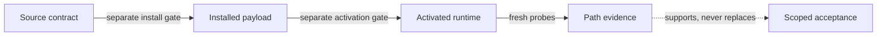

<!-- doc_id: signalbox.readme; language: zh-CN; contract_revision: 4 -->
<!-- contracts: SIG-01 SIG-02 IDENT-01 CLAIM-01 DOC-02 AUTH-05 ACCEPT-08 -->

[English](README.md) · **简体中文**

<a id="project-identity"></a>
# Signalbox

**给人和 agent 一起使用的、可解释的路由器分流参考。**

Signalbox 把真实路由器运维中的经验整理成 reader guide、portable contract、
public-safe example 和验证工具。普通读者不必先啃完所有 contracts：从下面最适合
自己的路径进入，只有在实现或 review policy 时再下钻到规范核心。`SIG-01`

<a id="choose-your-path"></a>
## 选择你的阅读路径

- **我只想弄懂路由器分流到底在做什么。** 看[路由器基础使用说明](docs/human/20-basic-router-guide.zh-CN.md)：
  什么责任移到路由器、什么仍要显式配置，以及日常使用里的 fail closed。
- **我要设计 routing / DNS policy。** 看[分流、DNS 与 fail-closed](docs/human/30-routing-dns-and-fail-closed.zh-CN.md)：
  ownership、precedence、protected lane、health 与 recovery boundary。
- **我要通过 VPS gateway 和 Tailnet 访问私有服务。** 看[canonical private-ingress
  指南](docs/human/40-tailnet-vps-private-ingress.zh-CN.md)：一个 HTTPS origin、独立身份、
  exact destination 与分层证据。

如果这些词还很陌生，先读五分钟版的[从这里开始](docs/human/00-start-here.zh-CN.md)
和[架构图](docs/human/10-architecture.zh-CN.md)即可。

<a id="what-signalbox-is"></a>
## Signalbox 是什么——又不是什么

Signalbox 解释 packet 为什么走某条路径，也给 agent 足够明确的 machine contract，
让它修改 policy 时不会把 source intent、installed payload 与 live truth 混在一起。
规范核心覆盖 transparent egress、DIRECT allowlist、protected no-fallback lane、
fail-closed enforcement、private ingress、health 与 recovery。

它不是 proxy client、one-click installer、production config 镜像，也不是 health
dashboard。source test 通过不代表路由器、出口、private origin、浏览器或设备此刻
健康。它只提炼 portable mechanism，不成为第二个 production authority。`SIG-02`

<a id="mintie-reference"></a>
## Mintie reference deployment

`Mintie` 是具名样例，不是 Signalbox 的另一个名字，也不是必买硬件。当前 reference
platform 是 [GL.iNet Beryl 7
(GL-MT3600BE)](https://www.gl-inet.com/products/gl-mt3600be/)；Signalbox 的 roles
和 contracts 故意保持 portable，可以映射到其他具备相应能力的路由器。`IDENT-01`

| 类型 | Signalbox 例子 | 含义 |
| --- | --- | --- |
| Portable role | `general-primary` | 稳定的 capability 与 policy semantics |
| Sample identity | `Alder` | Mintie reference deployment 里的友好名字 |
| Private live binding | 本 repo 之外 | 可替换的 endpoint、provider、credential、address 与 runtime state |

完整 identity map 与 public-safe sample contracts 见 [Mintie reference
files](examples/mintie/README.md)。

<a id="source-of-truth"></a>
## Source of truth 与证明边界

本 repo 故意把 human explanation、machine contract、sample deployment 与 live
implementation 分开：

- [`docs/specification.md`](docs/specification.md) 拥有产品含义；
- [`contracts/`](contracts/) 与 [`schemas/`](schemas/) 拥有 machine semantics 和
  structural validation；
- [`examples/mintie/`](examples/mintie/) 是 public-safe reference projection；
- private binding、installed payload、active runtime 与 incident readback 留在 repo 外。



一个绿色层只证明那一层；acceptance 与 technical realization 正交。`CLAIM-01`

<a id="verification"></a>
## 验证 source

首次建立隔离 development environment，然后运行完整 gate：

```bash
python3 -m venv .venv
.venv/bin/python -m pip install --requirement requirements-dev.txt
make verify PYTHON=.venv/bin/python
```

这个 gate 先用 fixed Draft 2020-12 schema bootstrap contract catalog，再验证跨文件
policy 与 health semantics、双语 document pairs、repo 内 contained links，并对
Git index 列出的每个 textual path 扫描其当前 worktree bytes 中的一组 bounded
public-boundary violations。binary blob 不会被 follow 或 decode；symlink 只检查
target，不会跟随。这个 detector 不是 Git history audit，也不是 universal secret
scanner。Hosted CI 会在 Python 3.11、3.12、3.13 上重复执行这个 source gate。
`AUTH-05`

Agent 从 [Agent Surface](docs/agent/README.md) 继续；事故机制见 [failure
catalog](docs/reference/failure-catalog.md)；准确 publication boundary 见 [current
state](docs/current-state.md)。

<a id="status-and-permission"></a>
## 状态与许可

Foundation 0.2.1 与 F1 Human Surface 仍然完成了 source verification 与 publication。
F0.2.2 executable-authority closure 在 [current state](docs/current-state.md) 记录
exact commit 与 hosted gate 前，只是 local source-verified candidate。完整 Signalbox
v1 尚未完成；这里不暗示 installed payload、live-router integration、private-ingress
deployment、path evidence 或 owner acceptance。`ACCEPT-08`

目前尚未选择 license。能够看到或持有本 repo 不等于获得 reuse rights。在明确
contribution 与 rights terms 之前，暂不接受外部 code 或 documentation contribution。
