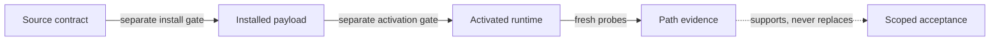

<!-- doc_id: signalbox.readme; language: zh-CN; contract_revision: 6 -->
<!-- contracts: SIG-01 SIG-02 IDENT-01 CLAIM-01 DOC-02 AUTH-05 ACCEPT-08 -->

[English](README.md) · **简体中文**

<a id="project-identity"></a>
# Signalbox

**给人和 agent 一起使用的、可解释的路由器分流参考。**

Signalbox 把真实路由器运维中的经验整理成 reader guide、portable contract、
public-safe example 和验证工具。普通读者不必先啃完所有 contracts：从下面最适合
自己的路径进入，只有在实现或 review policy 时再下钻到规范核心。`SIG-01`

<a id="choose-your-path"></a>
## 选择你的阅读路径

- **我只想弄懂路由器分流到底在做什么。** 看[路由器基础使用说明](docs/human/20-basic-router-guide.zh-CN.md)：
  什么责任移到路由器、什么仍要显式配置，以及日常使用里的 fail closed。
- **我要设计 routing / DNS policy。** 看[分流、DNS 与 fail-closed](docs/human/30-routing-dns-and-fail-closed.zh-CN.md)：
  ownership、precedence、protected lane、health 与 recovery boundary。
- **我想使用私有服务，又不想为它在手机上另开一次 VPN。** 看 [Tailnet-on-VPS
  指南](docs/human/40-tailnet-vps-private-ingress.zh-CN.md)：Mintie 接管实际覆盖的应用流量，
  专用 VPS gateway 加入 Tailnet，浏览器继续使用原来的 HTTPS 地址。手机 VPN 的流量封装
  与蜂窝网络客户端接入，需要各自的 compatibility 与证据。

如果这些词还很陌生，先读五分钟版的[从这里开始](docs/human/00-start-here.zh-CN.md)
和[架构图](docs/human/10-architecture.zh-CN.md)即可。

跟着 [五个完整案例](docs/human/50-worked-cases.zh-CN.md) 做一次判断：private/DIRECT
重叠、domain 与 IP-only 分流、router-local 与 LAN 覆盖、awake 与 sleeping client，
以及新发布的旧证据。agent 可以沿 [可执行 workflow](docs/agent/workflow.md) 从 structured
policy explanation 走到可校验的 claim/acceptance handoff。

### 翻开通信札记

Signalbox 的 **电报 reading station** 把这些内容放进同一个阅读入口：现成的猫插画、
穿孔纸带标记、手册、图解、案例，以及可以选择 synthetic replay receipt 的工作台。
完整正文直接从仓库 Markdown 构建，内容维护在一处。

安装下文的 development requirements 后：

```bash
make site PYTHON=.venv/bin/python
make site-serve PYTHON=.venv/bin/python
```

打开 preview command 输出的 loopback 地址。routes、build ownership、资产 provenance、
字体／图解的 network request 与预览方式见 [station guide](site/README.md)。这是由
source 构建的阅读页面，目前不声称 hosted site 或 deployment。

<a id="what-signalbox-is"></a>
## Signalbox 是什么——又不是什么

Signalbox 解释 packet 为什么走某条路径，也给 agent 足够明确的 machine contract，
让它修改 policy 时不会把 source intent、installed payload 与 live truth 混在一起。
规范核心覆盖 transparent egress、DIRECT allowlist、protected no-fallback lane、
fail-closed enforcement、private ingress、underlay observability、health 与 recovery。

它不是 proxy client、one-click installer、production config 镜像，也不是 health
dashboard。source test 通过不代表路由器、出口、private origin、浏览器或设备此刻
健康。它只提炼 portable mechanism，不成为第二个 production authority。`SIG-02`

<a id="mintie-reference"></a>
## Mintie reference deployment

`Mintie` 是具名样例，不是 Signalbox 的另一个名字，也不是必买硬件。当前 reference
platform 是 [GL.iNet Beryl 7
(GL-MT3600BE)](https://www.gl-inet.com/products/gl-mt3600be/)；Signalbox 的 roles
和 contracts 故意保持 portable，可以映射到其他具备相应能力的路由器。`IDENT-01`

| 类型 | Signalbox 例子 | 含义 |
| --- | --- | --- |
| Portable role | `general-primary` | 稳定的 capability 与 policy semantics |
| Sample identity | `Alder` | Mintie reference deployment 里的友好名字 |
| Private live binding | 本 repo 之外 | 可替换的 endpoint、provider、credential、address 与 runtime state |

完整 identity map 与 public-safe sample contracts 见 [Mintie reference
files](examples/mintie/README.md)。

<a id="source-of-truth"></a>
## Source of truth 与证明边界

本 repo 故意把 human explanation、machine contract、sample deployment 与 live
implementation 分开：

- [`docs/specification.md`](docs/specification.md) 拥有产品含义；
- [`contracts/`](contracts/) 与 [`schemas/`](schemas/) 拥有 machine semantics 和
  structural validation；
- [`examples/mintie/`](examples/mintie/) 是 public-safe reference projection；
- private binding、installed payload、active runtime 与 incident readback 留在 repo 外。


```mermaid
flowchart LR
  SOURCE[Source contract] -->|separate install gate| INSTALLED[Installed payload]
  INSTALLED -->|separate activation gate| ACTIVE[Activated runtime]
  ACTIVE -->|fresh probes| PATH[Path evidence]
  PATH -.->|supports, never replaces| ACCEPT[Scoped acceptance]
```

一个绿色层只证明那一层；acceptance 与 technical realization 正交。`CLAIM-01`

<a id="verification"></a>
## 验证 source

首次建立隔离 development environment，然后运行完整 gate：

```bash
python3 -m venv .venv
.venv/bin/python -m pip install --requirement requirements-dev.txt
make verify PYTHON=.venv/bin/python
```

这个 gate 先用 fixed Draft 2020-12 schema bootstrap contract catalog，再验证跨文件
policy 与 health semantics、双语 document pairs、repo 内 contained links，并对
Git index 列出的每个 textual path 扫描其当前 worktree bytes 中的一组 bounded
public-boundary violations。binary blob 不会被 follow 或 decode；symlink 只检查
target，不会跟随。这个 detector 不是 Git history audit，也不是 universal secret
scanner。Hosted CI 会在 Python 3.11、3.12、3.13 上重复执行这个 source gate。
`AUTH-05`

### 亲手跑一次 source 判断

建立上面的 environment 后，从 repo root 运行这些命令。它们只在本机读取公开的
synthetic example，不连接路由器，也不 apply policy。

| 你想检查什么 | 命令 | 输出能证明什么 |
| --- | --- | --- |
| canonical private ingress 的引用链为什么完整 | `.venv/bin/python -m scripts.policy` | Mintie source example 的 `valid`、origin → gateway → host → role/capabilities → subject/profile `chain` 与 `diagnostics` |
| routing、coverage、freshness 或 sequence 判断是否符合预期 | `.venv/bin/python -m scripts.replay` | 八个 synthetic result；每个 `passed` 比较 `actual` 与 `expected` |
| scoped source claim 与历史 acceptance 的引用是否合法 | `.venv/bin/python -m scripts.handoff --evaluated-at 2026-10-03T00:00:03Z` | 样例 handoff 的 `valid`、有依据的 `claim_outcomes` 与 `diagnostics` |

例如，重放一份刚发布、内部 observation 却已经过旧的 report：

```bash
.venv/bin/python -m scripts.replay --case new-report-old-observations
```

这个 scenario 在 `effective_outcome` 为 `unknown`、`restore_allowed` 为 `false`
时通过。这里的 `passed: true` 表示预期的拒绝行为成立，不代表观察路径健康。
handoff 命令的显式时间用于求值历史样例。想看完整四阶段 handoff 如何在 evidence
window 内通过、过期后被拒绝，继续看 [agent workflow](docs/agent/workflow.md#replay-a-historical-handoff)。

Agent 从 [Agent Surface](docs/agent/README.md) 继续；事故机制见 [failure
catalog](docs/reference/failure-catalog.md)；准确 publication boundary 见 [current
state](docs/current-state.md)。

<a id="status-and-permission"></a>
## 状态与许可

F0.3 underlay observability 已通过 PR #1 集成进 canonical `main`。
F2 Agent Surface 更新是 source candidate：完整 reference chain diagnostic、
observation/attempt freshness、实际 claim/acceptance 对象与 synthetic current-pointer
sequencing。精确 Git 与 hosted verification 状态在 [current state](docs/current-state.md)。
完整 Signalbox v1 尚未完成。synthetic record、scenario replay 与 source test 不证明
installed payload、activation、live path、deployed recovery 或 owner/client acceptance。
release 与 runtime gate 仍然独立。`ACCEPT-08`

目前尚未选择 license。能够看到或持有本 repo 不等于获得 reuse rights。在明确
contribution 与 rights terms 之前，暂不接受外部 code 或 documentation contribution。
