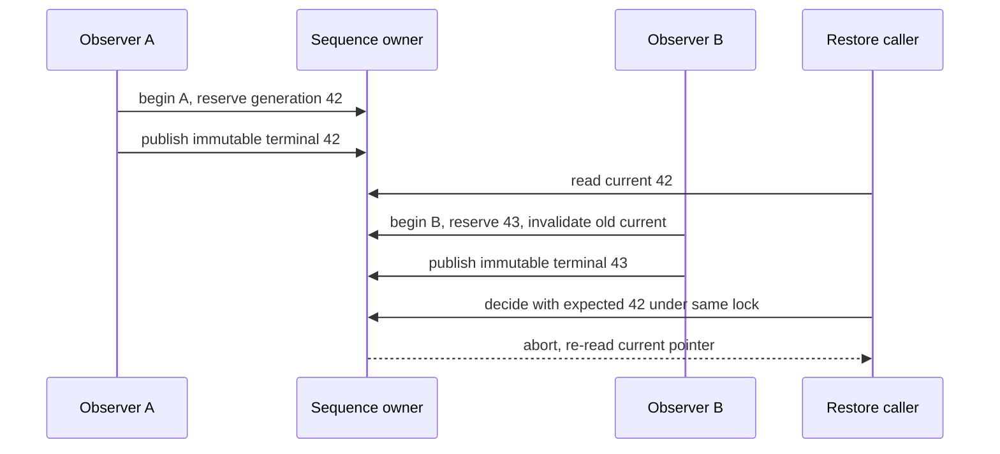

# 从事实到可校验交接

此入口服务第一次接触 Signalbox、要完成一次 source 判断的 agent。
`AGENTS.md` 和 [specification](../specification.md) 仍拥有权限与产品语义；
这里是可执行的使用路径。所有示例和 state machine 都是 synthetic，不产生 live mutation。

## 一次完整任务

1. 阅读 [catalog](../../contracts/catalog.json)，从 role/traffic/health/claims 的 owner
   找到规范；不要把 friendly identity 当 portable role。
2. 执行 policy explanation，沿 origin → gateway → host → role/capabilities →
   subject/profile 检查 source chain。`IDENT-03` `PRIVATE-01` `PRIVATE-02`
3. 运行 source gate。记录命令、scope 与真实输出；测试成功只支持 `source` claim。
4. 以 [source handoff](../../examples/mintie/handoff.json) 为结构样例，填写实际 evidence、
   claim 和 actor decision。这个样例记录不证明本次命令已执行；它也不表示 Faye 已验收。
5. 在明确 evaluation time 验证 handoff；有诊断就修正引用或证据，不能升级 stage 消除错误。
   [acceptance matrix](acceptance-matrix.md) 解释各阶段独立的 authority。

```bash
.venv/bin/python -m scripts.policy
make verify PYTHON=.venv/bin/python
.venv/bin/python -m scripts.handoff --file examples/mintie/handoff.json --evaluated-at 2026-10-03T00:00:03Z
.venv/bin/python -m scripts.replay
```

policy 输出 `valid`、`chain`、`diagnostics`；每条 diagnostic 有稳定 `code`、JSON-style
`path` 与 `message`。它解释 policy 引用，不执行流量，也不宣称 gateway 健康。
handoff 输出 `valid`、`claim_outcomes` 与同样的 structured diagnostics。

## Claim / acceptance 的真实对象

[claims contract](../../contracts/claims.json) 使用 `signalbox.claims/v2`。
[claim-record schema](../../schemas/claim-record.schema.json) 定义实际 claim：
`claim_id`、`scope_ref`、`stage`、`outcome`、`evidence_refs`、`observed_at`。
stage-specific reference 精确绑定 `source_ref`、`installed_ref + runtime_generation` 或
`activated_ref + health_report_ref + current_health_identity`。前置 claim stage 与 scope
必须相符，时间不能倒置；reference 不存在、跨 scope、用 source evidence 声称 installed
都会拒绝。bundle ID 与 repo-contained artifact path 是两个不同 namespace。

[acceptance-record/v2](../../schemas/acceptance-record.schema.json) 定义实际记录，替代旧的
descriptor-only v1 schema：`record_id`、`actor_class`、`actor_ref`、`decision`、`scope_ref`、
`claim_refs`、`evidence_refs`、`decided_at`。可选 decision 是 accepted/rejected/revoked。
决定必须引用存在且当时可用的证据，不得增加 realization stage。`CLAIM-01` `CLAIM-04`

[完整四阶段 handoff](../../examples/mintie/path-handoff.json) 只用于合成记录演示。
里面的 source、installed、activated artifact 指向公开样例，不是安装或 runtime readback。
在 lane report 的 `published_at` 求值，结构与引用通过；次日求值会拒绝 current path PASS，
即使历史 acceptance 仍记作 accepted。path claim scope 必须等于 health report subject，
profile 在 registry 中且完整有效；调用者传入的 current identity 必须来自可信 pointer read，
不能从想使用的历史 report 自己拼出“current”。

## Evaluator 的输入前提与兼容性

`evaluate_health_evidence(report, contract, profile, report_schema, evaluated_at,
expected_current_identity=...)` 是 canonical evaluator。输入时间必须 timezone-aware。
`report_schema` 使用当前 catalog 注册的可信 canonical health-report schema，不能由
未验证的外部输入替换成较弱的 schema；contract/profile 也必须来自当前已注册 source line。
它校验 report structure，也校验 contract 与单份 profile 的 structure/semantics，
然后校验 publication window、observation freshness 和 exact identity。结构错误先返回
`unknown / malformed-evidence`，不进入依赖类型的语义操作。`HEALTH-16` `HEALTH-20`

独立 evaluator 校验一个 profile 的完整内容。deployment topology 的 subject compatibility
与 exactly-one cardinality 由 repository/profile registry validation 负责；使用前应先验证
registry。提供 current identity 的调用者拥有该输入的 runtime truth；函数无法从一份 JSON
知道真实 pointer 是否已经改变。restore 再要求 exact gate context。

当前 schema line 是 health-contract/v6、health-profile/v3、claims/v2、acceptance-record/v2。
health-report/v2 与 health-aggregate/v2 的 shape 保持不变。旧 profile v2 缺少 observation
age/attempt duration，不属于这条 active line；更新每份 profile revision，并同步 report 与
aggregate 的 profile revision reference，不能只换 schema 名字。operational profile revision
是该 profile 的配置版本，不是 catalog 中 schema contract revision。

<a id="recovery-sequencing"></a>
## Current pointer、completion 次序与恢复竞态

[ReferencePublisher](../../scripts/reference_workflow.py) 使用单个 in-memory lock 序列化
reservation、publication 和 restore decision。它只返回允许/拒绝 receipt，不执行 restore。
report 通过 canonical evaluator，stored report/attempt terminal result immutable。
`HEALTH-11` `HEALTH-21`
[health contract 的 sequencing](../../contracts/health-contract.json) 是这些次序规则的正式 owner。



| Replay ID | 预期行为 |
| --- | --- |
| `pointer-changes-before-decision` | 42 的期望不能授权 43；abort-and-reread-current-pointer |
| `older-attempt-finishes-last` | 先开始的 42 晚完成，只 archive，43 保持 current |
| `restart-continuity-unknown` | 无法确认 epoch/sequence continuity，unknown、retain-guard |

新 attempt 在开始时预留 generation，并让旧 terminal PASS 失去 current 资格。
新 attempt checking 时仍保留 guard；终态 PASS/FAIL/UNKNOWN 都占据自己的 sequence position。
完成顺序不会重新分配 generation。普通 restart 可从可信 snapshot 恢复原 epoch/sequence；
continuity 无法确认时，较大的 generation 数字也不能补足证据，必须走明确 reset/migration。

部署者必须把 reservation/current state 持久化，把 compare、context/readback、授权的 effect
与 receipt 放进同一个可靠 transaction/lock boundary，并处理 crash/interrupted attempt，
发布合成或实际 unknown 终态。Python lock 和 snapshot 的通过测试不证明 filesystem CAS、
跨进程锁、断电持久性或真实恢复 effect 已实现。现有 harness 不声称这些 deployment 能力。

## Stop 和下一条证据

引用断裂先修 source；profile 缺维度先修 profile；证据 stale 重新执行已授权 probe；
identity/context mismatch 先 abort/re-read；query unsupported 保留 unknown。
任何安装、activation、route mutation、恢复 effect、live acceptance 都需要自己的权限和证据。
结合 [五个 paired worked cases](../human/50-worked-cases.zh-CN.md) 找有区分力的下一条观测。
