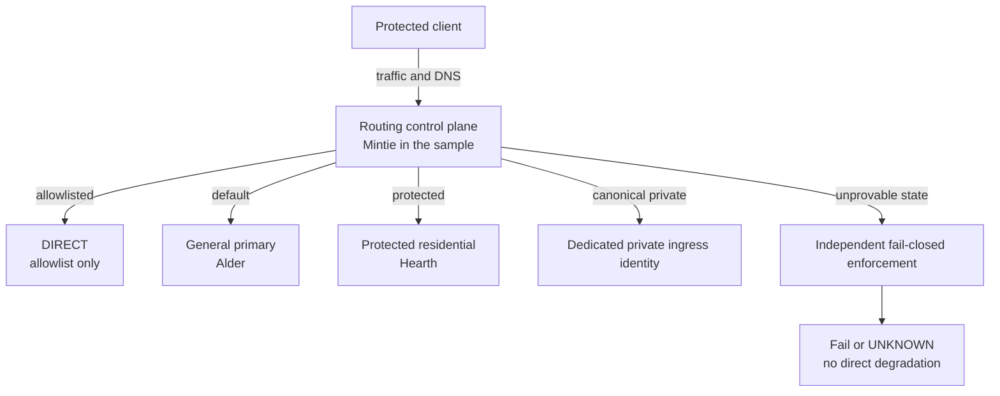

**English** · [简体中文](10-architecture.zh-CN.md)

# Signalbox architecture and packet paths

This diagram answers one question: where a protected client packet is captured,
classified, allowed, or rejected.

`ROUTE-01` requires one transparent routing owner. This does not forbid a DNS
service, firewall, or multiple upstreams. It forbids multiple control planes
from competing for DNS, default routes, packet marks, or interception
ownership without an explicit compatibility design.

## Protected lane

`ROUTE-04`

Hearth implements `claude-residential`. Its target is high recall: first-party,
authentication, storage, telemetry, risk, and observed compatibility
dependencies may all enter the protected egress. Collateral routing of shared
dependencies is an accepted cost.

If Hearth is unhealthy, matched traffic fails. It does not move to Alder,
Rowan, or DIRECT. That is an egress-identity requirement, not a missing node
selection feature.

## Independent enforcement

`ENFORCE-01`

The routing process classifies and dials. The guard prevents public DIRECT
leakage when the routing process, kernel state, or endpoint state is not
trustworthy. Process presence therefore cannot replace enforcement readback,
and guard presence cannot prove that a proxy path is reachable.

## Canonical-origin private ingress

`PRIVATE-01` `ROUTE-06`

The same `https://app.example` can retain its public path while an approved
client uses a dedicated gateway identity to reach an exact private origin. The
browser origin remains stable, so cookies, localStorage, Service Workers, and
PWA identity do not split across hostnames.

The private gateway needs a dedicated authenticated identity and server-side
exact allow. Even when Alder is co-located with that gateway, its
`general-primary` role does not automatically grant private-ingress capability.
The canonical private-ingress match is more specific than DIRECT allowlists and
must be evaluated first; otherwise a broad direct set can shadow the dedicated
gateway path.

## Recovery readiness is health

`HEALTH-07` `HEALTH-10` `HEALTH-15`

Recovery requires more than starting a service. The system must query and prove
prior kernel state, apply the intended state, verify postconditions, and retain
an explicit recovery state after failure. A cold-boot policy table that is not
yet instantiated and cannot be queried is recovery-unready. Its result remains
`unknown` until a platform-specific mechanism establishes queryability.

A `HealthReport` observes one subject only. Operational reports are maintained
for the control plane and each lane; the deployment aggregate preserves every
member outcome and has no top-level outcome. Automated failover or repair
belongs to a separate mutation state machine with hysteresis, operation
identity, rollback, and its own receipt. The aggregate is itself a historical
receipt evaluated at assembly; consumers create a new one for current truth.
