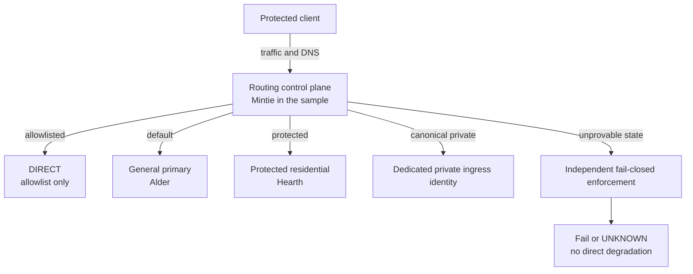

[English](10-architecture.en.md) · **简体中文**

# Signalbox 架构与 packet path

这张图回答一个问题：受保护 client 的 packet 在哪里被捕获、分类、允许或拒绝。

`ROUTE-01` 要求一个 transparent routing owner。这里的“一个”不是说系统不能
有 dnsmasq、firewall 或多个 upstream，而是不能让多个控制面同时争夺 DNS、
default route、packet mark 和 interception ownership。

Mintie executable projection 还把每个 settled route ID 绑定到 exact action、match
form 与 allowed field set。route order 仍然必要，但替换 action 或多塞一个 field
属于 contract drift，不是等价实现。`ROUTE-07`

## Protected lane

`ROUTE-04`

Hearth 承担 `claude-residential`。它的目标是 high recall：first-party、auth、
storage、telemetry、risk 与 observed compatibility dependencies 可以一起进入
protected egress。共享依赖的 collateral routing 是已接受成本。

如果 Hearth 不健康，matched traffic 失败。它不切到 Alder、Rowan 或 DIRECT。
这不是节点选择的遗漏，而是应用保护域的身份稳定性要求。

## Independent enforcement

`ENFORCE-01`

Routing process 负责分类和拨号；guard 负责在 routing process、kernel state 或
endpoint state 不可信时防止 public DIRECT leakage。二者职责不同，因此
“进程存在”不能替代 enforcement readback，“guard 仍在”也不能证明代理路径通。

## Canonical-origin private ingress

`PRIVATE-01` `ROUTE-06`

同一个 `https://app.example` 可以同时保留 public path，并让 approved client
通过 dedicated gateway identity 到 exact private origin。浏览器 origin 不变，
cookie、localStorage、Service Worker 和 PWA identity 不会因为换成另一个 hostname
而分裂。

Private gateway 必须有独立认证身份和 server-side exact allow。Alder 即使与这个
gateway co-locate，也不能因为它是 `general-primary` 就自动获得 private-ingress
能力。
canonical private-ingress match 比 DIRECT allowlist 更 specific，必须先求值；否则
过宽的 direct set 会先吃掉流量，让 dedicated gateway path 失效。

## Recovery readiness is health

`HEALTH-07` `HEALTH-10` `HEALTH-15`

恢复不仅需要“服务能启动”，还需要能查询并证明 prior kernel state、应用新的
state、验证 postcondition，并在失败时保留明确 recovery state。cold boot 下某个
policy table 尚未实例化而 query 失败，就是典型的 recovery-unready；它必须保持
`unknown`，直到平台特定机制建立可查询状态。

一份 `HealthReport` 只观察一个 subject。日常状态要分别保留 control plane 与
每条 lane 的 report；deployment aggregate 也必须保留所有 member outcome，且不设
top-level outcome。自动 failover 或 repair 属于另一套有 hysteresis、operation
identity、rollback 和 receipt 的 mutation state machine。aggregate 本身也是只在
assembly 时求值的 historical receipt；要得到 current truth，consumer 应生成新的一份。
