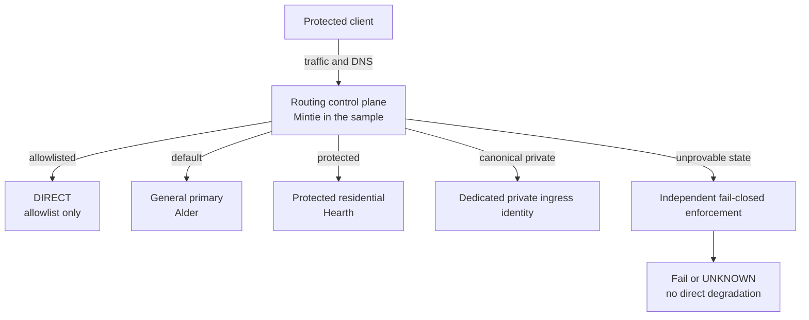
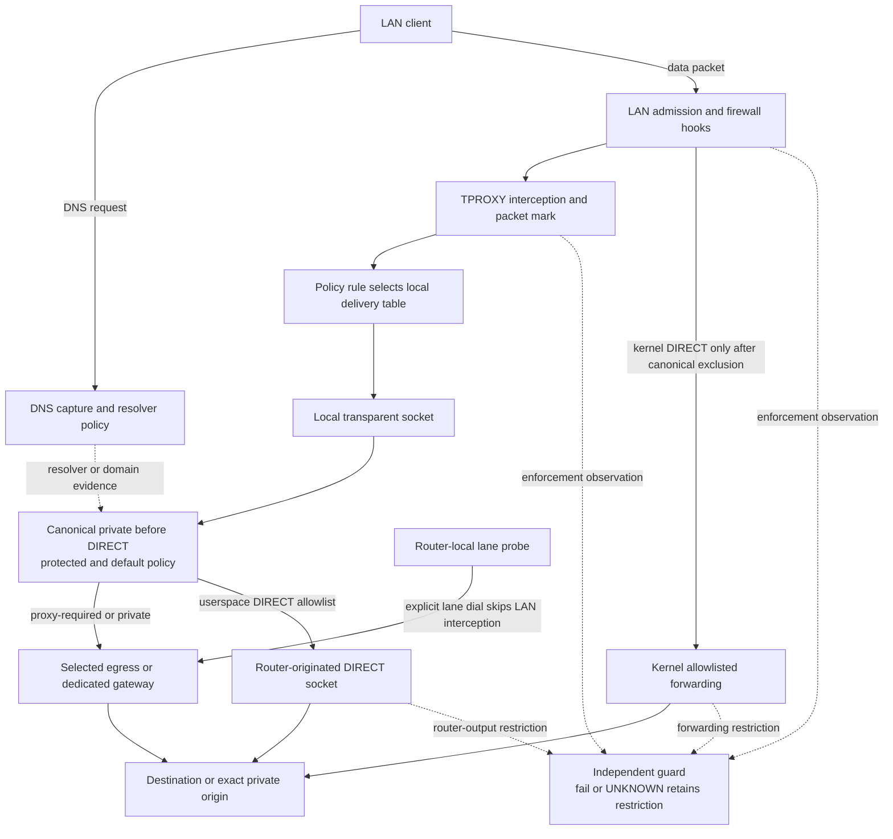

[English](10-architecture.en.md) · **简体中文**

# Signalbox 架构与 packet path

这张图回答一个问题：受保护 client 的 packet 在哪里被捕获、分类、允许或拒绝。

```mermaid
flowchart TD
  CLIENT[Protected client]
  OWNER[Routing control plane<br/>Mintie in the sample]
  DIRECT[DIRECT<br/>allowlist only]
  PRIMARY[General primary<br/>Alder]
  PROTECTED[Protected residential<br/>Hearth]
  PRIVATE[Dedicated private ingress identity]
  GUARD[Independent fail-closed enforcement]
  UNKNOWN[Fail or UNKNOWN<br/>no direct degradation]

  CLIENT -->|traffic and DNS| OWNER
  OWNER -->|allowlisted| DIRECT
  OWNER -->|default| PRIMARY
  OWNER -->|protected| PROTECTED
  OWNER -->|canonical private| PRIVATE
  OWNER -->|unprovable state| GUARD
  GUARD --> UNKNOWN
```

`ROUTE-01` 要求一个 transparent routing owner。这里的“一个”不是说系统不能
有 dnsmasq、firewall 或多个 upstream，而是不能让多个控制面同时争夺 DNS、
default route、packet mark 和 interception ownership。

Mintie executable projection 还把每个 settled route ID 绑定到 exact action、match
form 与 allowed field set。route order 仍然必要，但替换 action 或多塞一个 field
属于 contract drift，不是等价实现。`ROUTE-07`

## 实际 packet path 与观测位置

这是一种概念性的 Linux TProxy realization，不是 Mintie 的 live ruleset。
data 与 DNS 请求是两条 flow，domain policy 需要可用的 resolver/sniffing evidence。
Linux TProxy 结合 interception/packet mark、policy routing 到 local delivery、
以及 transparent listening socket；具体 mark、table、hook 与 admission rule 由 deployment
拥有。参考 [Linux kernel TProxy 文档](https://docs.kernel.org/networking/tproxy.html)。

```mermaid
flowchart TD
  CLIENT[LAN client]
  DNS[DNS capture and resolver policy]
  ADMIT[LAN admission and firewall hooks]
  MARK[TPROXY interception and packet mark]
  RULE[Policy rule selects local delivery table]
  SOCKET[Local transparent socket]
  POLICY[Canonical private before DIRECT<br/>protected and default policy]
  EGRESS[Selected egress or dedicated gateway]
  ORIGIN[Destination or exact private origin]
  FORWARD[Kernel allowlisted forwarding]
  OUTPUT[Router-originated DIRECT socket]
  GUARD[Independent guard<br/>fail or UNKNOWN retains restriction]
  PROBE[Router-local lane probe]

  CLIENT -->|DNS request| DNS
  DNS -.->|resolver or domain evidence| POLICY
  CLIENT -->|data packet| ADMIT
  ADMIT --> MARK --> RULE --> SOCKET --> POLICY
  POLICY -->|proxy-required or private| EGRESS --> ORIGIN
  ADMIT -->|kernel DIRECT only after canonical exclusion| FORWARD --> ORIGIN
  POLICY -->|userspace DIRECT allowlist| OUTPUT --> ORIGIN
  PROBE -->|explicit lane dial skips LAN interception| EGRESS
  ADMIT -.->|enforcement observation| GUARD
  MARK -.->|enforcement observation| GUARD
  FORWARD -.->|forwarding restriction| GUARD
  OUTPUT -.->|router-output restriction| GUARD
```

分别观察 LAN admission、interception mark、policy rule/local route、transparent socket、
所选 egress 与 forwarding guard。router-local 的显式 lane probe 从 egress 接入，
没有走 client 的 PREROUTING、mark-to-table delivery 或 admission 路径。
kernel DIRECT bypass 走 forwarding；userspace DIRECT 创建 router-originated output socket。
两者都必须先排除 canonical-origin match。forwarding/output restriction 与 local-delivery
admission 是不同 enforcement point；
deployment 必须核查实际 hook，不能把图直接当 ruleset。
router-to-egress 的健康证据让被跳过的边界继续保持 unknown。
[案例 3](50-worked-cases.zh-CN.md#router-probe-versus-lan) 可以检验这个推断。

## Protected lane

`ROUTE-04`

Hearth 承担 `claude-residential`。它的目标是 high recall：first-party、auth、
storage、telemetry、risk 与 observed compatibility dependencies 可以一起进入
protected egress。共享依赖的 collateral routing 是已接受成本。

如果 Hearth 不健康，matched traffic 失败。它不切到 Alder、Rowan 或 DIRECT。
这不是节点选择的遗漏，而是应用保护域的身份稳定性要求。

## Independent enforcement

`ENFORCE-01`

Routing process 负责分类和拨号；guard 负责在 routing process、kernel state 或
endpoint state 不可信时防止 public DIRECT leakage。二者职责不同，因此
“进程存在”不能替代 enforcement readback，“guard 仍在”也不能证明代理路径通。

## Canonical-origin private ingress

`PRIVATE-01` `ROUTE-06`

同一个 `https://app.example` 可以同时保留 public path，并让 approved client
通过 dedicated gateway identity 到 exact private origin。浏览器 origin 不变，
cookie、localStorage、Service Worker 和 PWA identity 不会因为换成另一个 hostname
而分裂。

Private gateway 必须有独立认证身份和 server-side exact allow。Alder 即使与这个
gateway co-locate，也不能因为它是 `general-primary` 就自动获得 private-ingress
能力。
canonical private-ingress match 比 DIRECT allowlist 更 specific，必须先求值；否则
过宽的 direct set 会先吃掉流量，让 dedicated gateway path 失效。

## Recovery readiness is health

`HEALTH-07` `HEALTH-10` `HEALTH-15` `HEALTH-18`

恢复不仅需要“服务能启动”，还需要能查询并证明 prior kernel state、应用新的
state、验证 postcondition，并在失败时保留明确 recovery state。cold boot 下某个
policy table 尚未实例化而 query 失败，就是典型的 recovery-unready；它必须保持
`unknown`，直到平台特定机制建立可查询状态。

一份 `HealthReport` 只观察一个 subject。日常状态要分别保留 control plane、
每条 lane，以及每个 registered network underlay 的 report。underlay 不是 lane：
`underlay-operational` profile 观察的是 DIRECT 路径本身：resolver 行为、loaded
responsiveness 与 recent availability / flap。因此 proxy lane 全绿并不能掩盖
degraded 的家庭 / WAN 路径。deployment aggregate 也必须保留所有 member outcome，
且不设 top-level outcome。自动 failover 或 repair 属于另一套有 hysteresis、
operation identity、rollback 和 receipt 的 mutation state machine。aggregate 本身
也是只在 assembly 时求值的 historical receipt；要得到 current truth，consumer 应
生成新的一份。
