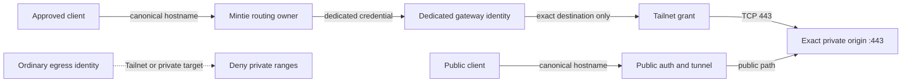

**English** · [简体中文](40-tailnet-vps-private-ingress.zh-CN.md)

# Tailnet and VPS private ingress

This advanced path preserves one browser origin across two ingress routes:

- a public client uses the public authentication and tunnel path;
- an approved private client uses Mintie, a dedicated VPS gateway identity,
  the Tailnet, and the exact private origin.

Both open the same canonical HTTPS hostname. Cookies, localStorage, IndexedDB,
Service Workers, PWA identity, and application URLs therefore remain attached
to one origin. A raw Tailnet address or a second Tailnet-only hostname would
solve reachability while splitting browser identity. `PRIVATE-01`

<!-- mermaid:id=canonical_private_ingress -->

## The private packet path

The portable reference flow is:

1. An approved client requests the canonical hostname.
2. Mintie captures the hostname inside its declared protected scope.
3. A rule more specific than every DIRECT allowlist selects a dedicated
   private-ingress identity, not the ordinary proxy identity. `ROUTE-06`
4. The VPS gateway authenticates under its private-ingress role and may dial
   only the declared origin service.
5. The gateway crosses the Tailnet under a narrowly owned tag or identity.
6. The private origin accepts that gateway identity on the exact service and
   presents a browser-trusted certificate for the canonical hostname.
7. Application authentication still applies. Network reachability is not an
   application login.

In this reference pattern, the VPS gateways join the Tailnet while Mintie
remains the sole routing and DNS policy owner. Adding another routing engine to
the router would require a separate compatibility design rather than becoming
an incidental setup step.

## Bound access at every authority

`PRIVATE-02`

| Boundary | Positive allow | Required negative proof |
| --- | --- | --- |
| Client/router policy | approved client + exact canonical hostname + intended transport | an unapproved client or hostname cannot select the private identity |
| Gateway credential | dedicated private-ingress identity | ordinary egress credentials cannot reach Tailnet or private destinations |
| Gateway destination policy | exact origin service only | the same identity cannot reach neighboring private services |
| Tailnet policy | tagged gateway to named origin service | unrelated users, devices, and tags remain denied |
| Origin listener/firewall | expected gateway path to HTTPS service | no unintended public or Tailnet-wide listener is created |
| Application | normal app authentication and authorization | network membership alone does not become application authority |

Tailscale Grants are additive: if several Grants match, their capabilities are
unioned and a more specific Grant does not override a broader one. Grants and
legacy ACLs may also coexist. Audit the whole policy before concluding that a
new narrow rule removed old access; see Tailscale's official [Grants syntax
reference](https://tailscale.com/docs/reference/syntax/grants).

The private origin normally sees the gateway identity, not the original phone
or laptop. That is useful for stable policy, but it makes narrow gateway tags,
destination controls, and origin-side logs essential.

## Bind hostname, destination, and transport together

Split DNS alone is not enough. A client may use encrypted DNS, cache a public
answer, reuse a connection, or retain Service Worker state. The accepted
private path therefore combines:

- exact canonical-hostname matching;
- protocol or SNI observation where the engine supports it;
- a bounded destination override to the private origin;
- canonical SNI and certificate validation at the origin; and
- scoped UDP/443 rejection when only the TCP private path is proven.

`ROUTE-05` does not ban QUIC universally. It says a protected flow may not use
an unproved direct QUIC escape. Once the deployment proves an equivalent
protected UDP path, it may adopt that transport through an explicit contract
change.

Ordinary general egress must still deny Tailnet and private destination space.
The canonical rule is evaluated earlier only for the approved hostname/client
scope; it is not a broad exception that turns a proxy VPS into a subnet router.

## Evidence, failure, and what is not claimed

`PRIVATE-03` `PRIVATE-04` `CLAIM-01`

Keep the proof layers separate:

| Layer | Minimum useful evidence |
| --- | --- |
| Source | route order, dedicated identity, exact destination, negative policy, and public-safe tests |
| Installed | exact payload/config identity on Mintie, gateways, Tailnet policy, and origin |
| Activated | loaded router rules, gateway process, Tailnet membership/grants, listener, firewall, and certificate state |
| Path | positive canonical request plus negative ordinary-identity and neighboring-destination probes |
| Client acceptance | canonical URL, trusted TLS, expected app auth, and PWA/browser behavior on the named device |

The public and private paths have independent health. A healthy public tunnel
does not prove Tailnet ingress, and a reachable Tailnet peer does not prove the
canonical TLS/application path.

No automatic public fallback is implied. If the accepted private lane fails,
its matched flow fails closed. Deliberately switching a client back to the
public path is a separate policy or user action. Likewise, a primary and backup
gateway do not create strict failover by existing; latency selection is not
ordered primary/secondary behavior.

This document is a source reference, not a claim that any Tailnet, VPS, router,
origin, or client is installed, activated, or healthy. Agents implementing the
pattern should continue with the [Tailnet/VPS implementation
reference](../agent/tailnet-vps-implementation-reference.md).
