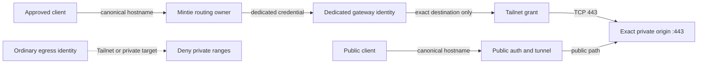

[English](40-tailnet-vps-private-ingress.en.md) · **简体中文**

# Tailnet 与 VPS private ingress

这条 advanced path 用两条 ingress route 保留同一个 browser origin：

- public client 走 public authentication 与 tunnel path；
- approved private client 走 Mintie、dedicated VPS gateway identity、Tailnet 与
  exact private origin。

两边打开同一个 canonical HTTPS hostname，因此 cookies、localStorage、IndexedDB、
Service Worker、PWA identity 与 application URL 仍然属于一个 origin。直接使用
Tailnet address 或另建 Tailnet-only hostname 虽然能解决 reachability，却会分裂
browser identity。`PRIVATE-01`

<!-- mermaid:id=canonical_private_ingress -->

## Private packet path

Portable reference flow 如下：

1. approved client 请求 canonical hostname；
2. Mintie 在 declared protected scope 内捕获这个 hostname；
3. 一条比所有 DIRECT allowlist 更 specific 的 rule 选择 dedicated
   private-ingress identity，而不是普通 proxy identity；`ROUTE-06`
4. VPS gateway 用 private-ingress role 认证，并且只能 dial declared origin service；
5. gateway 以 narrowly owned tag / identity 穿过 Tailnet；
6. private origin 只在 exact service 接受这个 gateway identity，并为 canonical
   hostname 提供 browser-trusted certificate；
7. application authentication 仍然生效；network reachability 不是 app login。

在这套 reference pattern 里，VPS gateways 加入 Tailnet，Mintie 仍然是唯一 routing
与 DNS policy owner。若要在路由器上加入第二个 routing engine，需要单独设计
compatibility，不能把它当作顺手多装一个 package。

## 在每个 authority 都收紧 access

`PRIVATE-02`

| Boundary | Positive allow | 必须具备的 negative proof |
| --- | --- | --- |
| Client/router policy | approved client + exact canonical hostname + intended transport | unapproved client / hostname 不能选择 private identity |
| Gateway credential | dedicated private-ingress identity | ordinary egress credential 不能访问 Tailnet / private destination |
| Gateway destination policy | exact origin service only | 同一 identity 不能访问 neighboring private service |
| Tailnet policy | tagged gateway 到 named origin service | unrelated user、device、tag 仍被拒绝 |
| Origin listener/firewall | expected gateway path 到 HTTPS service | 不产生 unintended public 或 Tailnet-wide listener |
| Application | 正常 app authentication 与 authorization | network membership 本身不成为 application authority |

Tailscale Grants 是 additive：多条 Grants 同时匹配时，capabilities 取 union；更
specific 的 Grant 不会覆盖较宽的旧 Grant。Grants 与 legacy ACLs 也可以共存。
所以不能因为“刚加了一条很窄的规则”就断言旧 access 消失；必须审计完整 policy。
官方语义见 Tailscale [Grants syntax
reference](https://tailscale.com/docs/reference/syntax/grants)。

Private origin 通常看到的是 gateway identity，而不是最初的 phone / laptop。这让
policy 更稳定，但也使 narrow gateway tag、destination control 与 origin-side log
成为必要边界。

## 把 hostname、destination 与 transport 绑在一起

Split DNS 本身不够。client 可能使用 encrypted DNS、缓存 public answer、复用
connection 或保留 Service Worker state。可接受的 private path 因此组合：

- exact canonical-hostname matching；
- engine 支持时进行 protocol / SNI observation；
- bounded destination override 到 private origin；
- origin 端 canonical SNI 与 certificate validation；
- 只证明 TCP private path 时，scoped reject UDP/443。

`ROUTE-05` 不是全面禁止 QUIC；它只是不允许 protected flow 使用尚未证明的
direct QUIC escape。deployment 以后若证明 equivalent protected UDP path，可以通过
显式 contract change 采用它。

普通 general egress 仍应拒绝 Tailnet 与 private destination space。只有 approved
hostname/client scope 的 canonical rule 会更早求值；它不是把 proxy VPS 变成 subnet
router 的宽泛例外。

## Evidence、failure 与没有做出的 claim

`PRIVATE-03` `PRIVATE-04` `CLAIM-01`

Proof layers 必须分开：

| 层 | 最少有用证据 |
| --- | --- |
| Source | route order、dedicated identity、exact destination、negative policy 与 public-safe tests |
| Installed | Mintie、gateway、Tailnet policy、origin 上 exact payload/config identity |
| Activated | loaded router rules、gateway process、Tailnet membership/grants、listener、firewall、certificate state |
| Path | positive canonical request，加 ordinary-identity 与 neighboring-destination negative probes |
| Client acceptance | named device 上 canonical URL、trusted TLS、expected app auth 与 PWA/browser behavior |

Public 与 private path 的 health 彼此独立。public tunnel 健康不证明 Tailnet ingress；
Tailnet peer 可达也不证明 canonical TLS / application path。

这里不暗示 automatic public fallback。accepted private lane 失败时，它匹配的 flow
fail closed；把 client 明确切回 public path 是另一项 policy 或 user action。同理，
primary / backup gateway 仅仅同时存在，不会自动产生 strict failover；latency
selection 不是 ordered primary/secondary behavior。

本文是 source reference，不声称任何 Tailnet、VPS、router、origin 或 client 已经
installed、activated 或 healthy。Agent 要实现这套 pattern，应继续阅读
[Tailnet/VPS implementation
reference](../agent/tailnet-vps-implementation-reference.md)。
