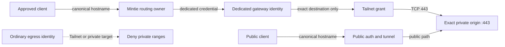

[English](40-tailnet-vps-private-ingress.en.md) · **简体中文**

# 把 Tailnet 交给 VPS，让手机少切一次 VPN

手机想打开自己的私有应用，又不想先关掉日常网络工具、打开 Tailscale，再在用完后
切回去。这里介绍一种组合：VPS 加入 Tailnet，带认证的专用入口只代拨获准的
HTTPS 服务；手机在被路由器覆盖的路径上，不必额外启动 Tailscale。

这篇的 reference 接法由 **Mintie 接管对应应用的 routing 与 DNS policy**。
VPS 承担 Tailnet 成员身份，应用继续承担登录与权限。便利来自把这些责任安排到
不同位置，而不是让手机获得整个 Tailnet 的访问权。

## 先确认这篇覆盖你的哪条路径

| 你的接法 | 这篇支持的结论 |
| --- | --- |
| 手机的对应应用流量实际由 Mintie 分类、送往专用 gateway | 不需要在手机上再启动 Tailscale；普通访问和指定私有服务由声明好的路由分别处理 |
| 手机已有 VPN 把对应流量封装后送往别处 | 不能默认 Mintie 仍能识别里面的 hostname；先明确 routing owner 与 compatibility |
| 手机在蜂窝网络上，想沿用现有 proxy client | 需要客户端支持的出站协议、hostname rule、DNS 与认证入口，以及独立 path 验收；当前 reference 未交付这条完整接法 |

Tailscale 的 [VPN 共存说明](https://tailscale.com/docs/reference/faq/other-vpns)
列出了 iOS / Android 同时只能运行一个 active VPN 的设备限制。把 Tailnet 放到
VPS 可以移走这项终端责任，但 VPS 加入 Tailnet 本身不会建立手机到 gateway 的路径。

如果手机直接使用 Tailscale 已足够，额外维护 VPS gateway 未必值得。需要一台能
管理的 VPS、SSH 或服务部署基础时，可以先读 [Infra Field Guide](https://indeliblevivi.github.io/infra-field-guide/)；
它也有远程 worker 管理机器的 private-access 用法。本文继续讲终端怎样方便地使用服务。

## 继续使用原来的 HTTPS 地址

这条接法用两条 ingress route 保留同一个 browser origin：

- public client 走 public authentication 与 tunnel path；
- approved private client 走 Mintie、dedicated VPS gateway identity、Tailnet 与
  exact private origin。

两边打开同一个 canonical HTTPS hostname，因此 cookies、localStorage、IndexedDB、
Service Worker、PWA identity 与 application URL 仍然属于一个 origin。直接使用
Tailnet address 或另建 Tailnet-only hostname 虽然能解决 reachability，却会分裂
browser identity。`PRIVATE-01`

例如，浏览器两次都打开 `https://notes.example.com`，变的是请求经过的路径。
入口、VPS 实际拨号地址与浏览器 URL 是三个不同位置；不能因为后端位于 Tailnet，
就让浏览器改用私网地址。相同 origin 保留存储的归属，应用自身的登录、cookie policy
和 public/private authentication 仍须分别验证。

<!-- mermaid:id=canonical_private_ingress -->

```mermaid
flowchart LR
  accTitle: Canonical private ingress
  accDescr: An approved client is captured by Mintie and uses a dedicated gateway identity through the Tailnet to the exact origin. A public client uses the public edge. Ordinary egress identities are denied access to private ranges.
  approved["Approved client"]
  mintie["Mintie routing owner"]
  gateway["Dedicated gateway identity"]
  tailnet["Tailnet grant"]
  origin["Exact private origin :443"]
  public_client["Public client"]
  public_edge["Public auth and tunnel"]
  ordinary["Ordinary egress identity"]
  deny["Deny private ranges"]
  approved -->|canonical hostname| mintie
  mintie -->|dedicated credential| gateway
  gateway -->|exact destination only| tailnet
  tailnet -->|TCP 443| origin
  public_client -->|canonical hostname| public_edge
  public_edge -->|public path| origin
  ordinary -.->|Tailnet or private target| deny
```

## Private packet path

Portable reference flow 如下：

1. approved client 请求 canonical hostname；
2. Mintie 在 declared protected scope 内捕获这个 hostname；
3. 一条比所有 DIRECT allowlist 更 specific 的 rule 选择 dedicated
   private-ingress identity，而不是普通 proxy identity；`ROUTE-06`
4. VPS gateway 用 private-ingress role 认证，并且只能 dial declared origin service；
5. gateway 以 narrowly owned tag / identity 穿过 Tailnet；
6. private origin 只在 exact service 接受这个 gateway identity，并为 canonical
   hostname 提供 browser-trusted certificate；
7. application authentication 仍然生效；network reachability 不是 app login。

在这套 reference pattern 里，VPS gateways 加入 Tailnet，Mintie 仍然是唯一 routing
与 DNS policy owner。若要在路由器上加入第二个 routing engine，需要单独设计
compatibility，不能把它当作顺手多装一个 package。

## 把每个输入放到它真正工作的地方

动手前，先把这些位置对齐。表中的文件是 portable source example，不是可以直接
安装的 runtime config；endpoint、credential、真实 client identity 与 readback 留在私有实现里。

| 运行位置 | 需要明确的输入 | 当前 source reference | 完成后要确认什么 |
| --- | --- | --- | --- |
| Mintie | approved client scope、canonical hostname、transport、专用 gateway binding | [traffic-policy](../../examples/mintie/traffic-policy.json) 与 [deployment](../../examples/mintie/deployment.json) | private rule 先于 DIRECT；只有获准请求选择 private identity |
| VPS gateway | 独立 inbound credential、private-ingress role、exact origin service | [role capabilities](../../contracts/roles.json) 与 deployment 的 gateway bindings | 认证成功只能拨指定服务；ordinary credential 和相邻目的地均被拒绝 |
| Tailnet policy | gateway identity/tag 到 origin service 的 allow | 下节的 authority 表与 [agent 实现参考](../agent/tailnet-vps-implementation-reference.md) | 审计完整 additive policy；旧的宽授权不能被忽略 |
| Private origin | exact listener/firewall、canonical SNI、trusted certificate | 下文 hostname / transport 约束 | canonical TLS 与应用认证成立；未出现额外公开或私网 listener |
| 观测与收尾 | 每个 subject 的 profile、正向与负向 path evidence | [health profiles](../../examples/mintie/health-profiles.json) 与 [acceptance matrix](../agent/acceptance-matrix.md) | 证据属于具名路径、当前 scope 与有效窗口，不能只看 peer 在线 |

canonical hostname、gateway binding、origin service 和 transport 要在这些位置互相
对应。第一次 source 判断可运行 `.venv/bin/python -m scripts.policy`，从
origin → gateway → host → role/capabilities → subject/profile 跟完整引用链。
通过只证明 source 一致；具体 engine 的安装配置与 client 接入仍属于 implementation。

## 在每个 authority 都收紧 access

`PRIVATE-02`

| Boundary | Positive allow | 必须具备的 negative proof |
| --- | --- | --- |
| Client/router policy | approved client + exact canonical hostname + intended transport | unapproved client / hostname 不能选择 private identity |
| Gateway credential | dedicated private-ingress identity | ordinary egress credential 不能访问 Tailnet / private destination |
| Gateway destination policy | exact origin service only | 同一 identity 不能访问 neighboring private service |
| Tailnet policy | tagged gateway 到 named origin service | unrelated user、device、tag 仍被拒绝 |
| Origin listener/firewall | expected gateway path 到 HTTPS service | 不产生 unintended public 或 Tailnet-wide listener |
| Application | 正常 app authentication 与 authorization | network membership 本身不成为 application authority |

Tailscale Grants 是 additive：多条 Grants 同时匹配时，capabilities 取 union；更
specific 的 Grant 不会覆盖较宽的旧 Grant。Grants 与 legacy ACLs 也可以共存。
所以不能因为“刚加了一条很窄的规则”就断言旧 access 消失；必须审计完整 policy。
官方语义见 Tailscale [Grants syntax
reference](https://tailscale.com/docs/reference/syntax/grants)。

Private origin 通常看到的是 gateway identity，而不是最初的 phone / laptop。这让
policy 更稳定，但也使 narrow gateway tag、destination control 与 origin-side log
成为必要边界。

## 把 hostname、destination 与 transport 绑在一起

Split DNS 本身不够。client 可能使用 encrypted DNS、缓存 public answer、复用
connection 或保留 Service Worker state。可接受的 private path 因此组合：

- exact canonical-hostname matching；
- engine 支持时进行 protocol / SNI observation；
- bounded destination override 到 private origin；
- origin 端 canonical SNI 与 certificate validation；
- 只证明 TCP private path 时，scoped reject UDP/443。

`ROUTE-05` 不是全面禁止 QUIC；它只是不允许 protected flow 使用尚未证明的
direct QUIC escape。deployment 以后若证明 equivalent protected UDP path，可以通过
显式 contract change 采用它。

普通 general egress 仍应拒绝 Tailnet 与 private destination space。只有 approved
hostname/client scope 的 canonical rule 会更早求值；它不是把 proxy VPS 变成 subnet
router 的宽泛例外。

## Evidence、failure 与没有做出的 claim

`PRIVATE-03` `PRIVATE-04` `CLAIM-01`

Proof layers 必须分开：

| 层 | 最少有用证据 |
| --- | --- |
| Source | route order、dedicated identity、exact destination、negative policy 与 public-safe tests |
| Installed | Mintie、gateway、Tailnet policy、origin 上 exact payload/config identity |
| Activated | loaded router rules、gateway process、Tailnet membership/grants、listener、firewall、certificate state |
| Path | positive canonical request，加 ordinary-identity 与 neighboring-destination negative probes |
| Client acceptance | named device 上 canonical URL、trusted TLS、expected app auth 与 PWA/browser behavior |

Public 与 private path 的 health 彼此独立。public tunnel 健康不证明 Tailnet ingress；
Tailnet peer 可达也不证明 canonical TLS / application path。

这里不暗示 automatic public fallback。accepted private lane 失败时，它匹配的 flow
fail closed；把 client 明确切回 public path 是另一项 policy 或 user action。同理，
primary / backup gateway 仅仅同时存在，不会自动产生 strict failover；latency
selection 不是 ordered primary/secondary behavior。

## 回到手机上，确认获得了什么

在自己的部署经过授权、安装与 activation 后，用同一台具名设备收尾：

1. 手机不额外启动 Tailscale，且这次应用流量确实由声明的 routing owner 接管。
2. 打开 canonical HTTPS URL，检查 trusted TLS、正常 app login 和所需 browser/PWA 行为。
3. 普通请求仍走其声明路径；ordinary egress credential 不能借此进入私有服务。
4. 用 private identity 请求相邻服务仍被拒绝；private lane 失效时，获准 flow 停止，
   不自动转入 DIRECT 或 public path。任何故障注入也需要单独授权。
5. 如需撤回，先保留独立 management access，再按自己部署的已授权 rollback procedure
   撤回路由、gateway allow 与 Tailnet grant，并重新确认权限范围；本文不提供 apply/rollback 脚本。

成功的观察可以支持这一次具名 client 的 scoped acceptance；不能升级成所有手机、
蜂窝网络或未来时刻的保证。

本文是 source reference，不声称任何 Tailnet、VPS、router、origin 或 client 已经
installed、activated 或 healthy。Agent 要实现这套 pattern，应继续阅读
[Tailnet/VPS implementation
reference](../agent/tailnet-vps-implementation-reference.md)。
