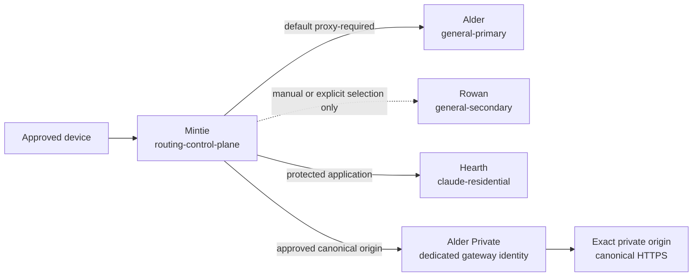

# Mintie Reference Deployment

Mintie is Signalbox's complete named sample. These files demonstrate portable
role binding and policy semantics without containing a production endpoint,
credential, address, client identity, or current runtime claim.

## Identity map

| Sample identity | Portable role | Notes |
| --- | --- | --- |
| Mintie | `routing-control-plane` | Owns transparent policy for the sample protected scope |
| Alder | `general-primary` | Default proxy-required egress |
| Rowan | `general-secondary` | Independent standby; no automatic failover implied |
| Hearth | `claude-residential` | High-recall protected residential egress; no fallback |
| Alder Private | `private-ingress-primary` | Dedicated identity co-located with Alder |
| Rowan Private | `private-ingress-secondary` | Dedicated identity co-located with Rowan |

The dedicated gateway identities are separate even when their hosts are
co-located with Alder or Rowan. General egress credentials never inherit
private-origin access.

## Files

- `deployment.json` binds sample identities to portable roles.
- `traffic-policy.json` evaluates canonical private ingress before DIRECT,
  demonstrates protected no-fallback, and preserves dedicated gateway identity.
- `health-profiles.json` defines one recovery profile, one control-plane
  operational profile, and one operational profile per egress or private-ingress
  lane.
- `reports/` contains public-safe immutable examples for each subject plus a
  separate recovery-preflight receipt. Dimensions contain explicit observations
  so evidence-class and dependency-group diversity can be validated.
- `health-aggregate.json` references all six operational members and preserves
  their individual outcomes. It excludes recovery-preflight and deliberately
  has no top-level outcome.

The sample operational interval is 15 minutes and each operational report
remains fresh for at most 20 minutes. Recovery-preflight reports remain fresh
for at most five minutes and exact-match one operation, desired-state digest,
runtime generation, restore scope, and expected generation epoch. History is
bounded by a 256 KiB file limit, two archives, and 288 entries. The numbers are
sample deployment policy, not universal router requirements.

## Deliberate boundary

There is no install or apply command here. A real implementation must perform
an applicability review, supply its own private bindings, and pass source,
installed, activated, and path-evidence gates separately. Any acceptance record
is a scoped human decision, not another technical stage.
